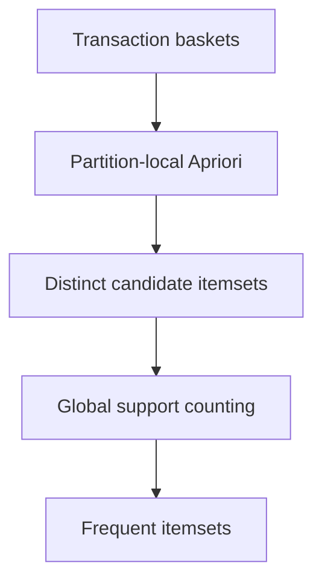

# Frequent Itemset Mining with SON and PySpark


A from-scratch implementation of the two-pass SON algorithm for frequent-itemset mining on distributed transaction baskets. The project combines partition-local Apriori candidate generation with a global support-counting pass in PySpark.

## Algorithm



### Pass 1 — candidate generation

1. Partition transaction baskets across Spark workers.
2. Scale the global support threshold to each partition.
3. Run Apriori locally, including join-and-prune candidate generation.
4. Union and deduplicate candidates produced by every partition.

### Pass 2 — global verification

1. Count each candidate against the complete distributed basket set.
2. Reduce counts by itemset.
3. Retain itemsets that meet the global support threshold.

## Implementations

| Script | Dataset | Purpose |
|---|---|---|
| `task1.py` | small user–business baskets | validates both basket orientations and support behavior |
| `task2.py` | Ta-Feng retail transactions | preprocesses date/customer baskets, filters small baskets, and mines frequent products |

The repository includes small fixtures, the Ta-Feng input used for the exercise, and a sample candidate/frequent-itemset result.

## Run locally

Prerequisites:

- Python 3
- Apache Spark / PySpark

```bash
spark-submit task1.py
spark-submit task2.py
```

Input paths, support thresholds, basket filters, and output paths are configured near the top of each script.

## Engineering takeaways

- local support scaling allows partitions to generate a complete candidate set;
- Apriori subset pruning controls combinatorial growth;
- the second distributed pass removes partition-local false positives;
- deterministic ordering makes large result files easier to validate.

> This repository is retained as a 2023 educational implementation. It favors algorithm transparency over production packaging.

