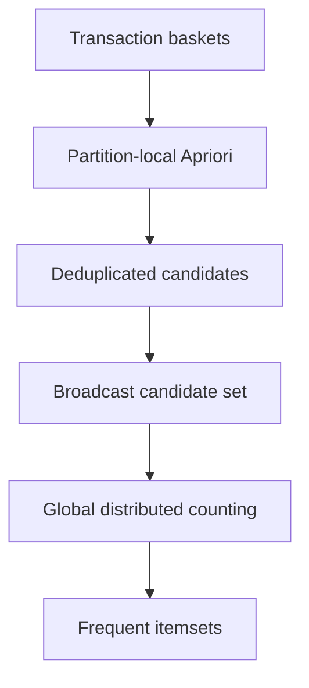

# Frequent Itemset Mining with SON and PySpark

[](https://github.com/Wizc1998/realization-of-SON-Algorithm-using-the-Spark-Framework/actions/workflows/ci.yml)


A deterministic, tested implementation of the two-pass SON algorithm for frequent-itemset mining. It combines partition-local Apriori candidate generation with global distributed support verification in PySpark.

The repository began as a 2023 graduate algorithm project. The original `task1.py` and `task2.py` are preserved; the `son_miner` package is the reusable implementation with clearer contracts and automated tests.

## Algorithm



### Pass 1 — candidate generation

1. Group input pairs into transaction baskets.
2. Scale global support to each Spark partition.
3. Generate frequent singletons locally.
4. Join frequent `(k-1)` itemsets and prune any candidate whose subset is absent.
5. Union and deduplicate candidates from all partitions.

### Pass 2 — global verification

1. Broadcast the candidate set.
2. Count candidate containment across all baskets.
3. Reduce counts and retain itemsets meeting global support.
4. Sort by itemset size and lexical order for reproducible output.

## Run

```bash
python -m pip install -r requirements.txt

python -m son_miner.cli \
  --master 'local[*]' \
  --input data/small2.csv \
  --output output/frequent-itemsets.json \
  --support 4 \
  --orientation left-baskets
```

For the Ta-Feng dataset, use `--min-basket-size` to remove very small baskets before mining:

```bash
python -m son_miner.cli \
  --master 'local[*]' \
  --input data/dt-customer_product.csv \
  --output output/ta-feng-itemsets.json \
  --support 50 \
  --min-basket-size 21
```

## Output contract

```json
{
  "candidates": [["item-a"], ["item-a", "item-b"]],
  "frequent_itemsets": [["item-a"]],
  "candidate_count": 2,
  "frequent_itemset_count": 1
}
```

## Engineering improvements

- isolates dependency-free Apriori primitives from Spark orchestration;
- uses canonical tuples and deterministic output ordering;
- applies join-and-prune candidate generation instead of repeated unstructured set unions;
- validates support, basket counts, orientation, and minimum basket size;
- parses CSV partitions safely and removes the header only once;
- broadcasts global candidates and explicitly releases the broadcast;
- tests candidate pruning, support scaling, global counting, and output contracts in CI.

The included Ta-Feng input is retained from the original educational exercise. For large production workloads, candidate memory, basket skew, and broadcast size should be monitored explicitly.

